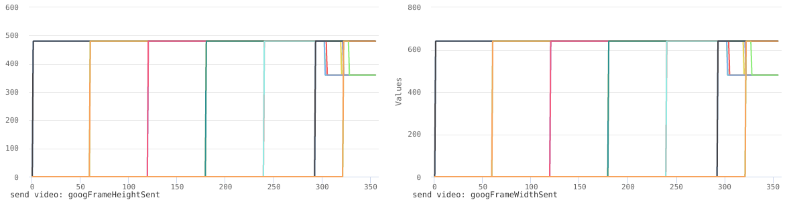
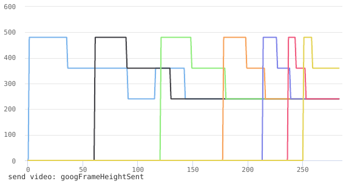

# Групповые звонки через браузер, в рамках отдельных сессий. Настройки аудио и видео по-умолчанию.

В тестах использовались две машины:

HP:
```
System:    Host: hppc Kernel: 4.4.39-1-MANJARO x86_64 (64 bit gcc: 6.2.1)
           Desktop: Xfce 4.12.3 (Gtk 2.24.31) info: xfce4-panel dm: lightdm Distro: Manjaro Linux
Machine:   Device: laptop System: Hewlett-Packard product: HP Pavilion dv7 Notebook PC v: 0595100000244710000020100
           Mobo: Hewlett-Packard model: 165A v: 10.22 BIOS: Hewlett-Packard v: F.06 date: 03/10/2011
           Chassis: type: 10
Battery    BAT0: charge: 13.4 Wh 40.0% condition: 33.5/55.1 Wh (61%) volts: 11.1/10.8
           model: Hewlett-Packard 5100 serial: Li4402A status: N/A cycles: 0
CPU:       Quad core Intel Core i7-2630QM (-HT-MCP-) cache: 6144 KB
           flags: (lm nx sse sse2 sse3 sse4_1 sse4_2 ssse3 vmx) bmips: 15969
           clock speeds: min/max: 800/2900 MHz 1: 2756 MHz 2: 2752 MHz 3: 2639 MHz 4: 2759 MHz 5: 2777 MHz
           6: 2686 MHz 7: 2797 MHz 8: 2774 MHz
Graphics:  Card-1: Intel 2nd Generation Core Processor Family Integrated Graphics Controller
           bus-ID: 00:02.0 chip-ID: 8086:0116
           Card-2: Advanced Micro Devices [AMD/ATI] Whistler [Radeon HD 6730M/6770M/7690M XT]
           bus-ID: 01:00.0 chip-ID: 1002:6740
           Display Server: X.Org 1.17.4 drivers: intel (unloaded: modesetting,fbdev,vesa)
           Resolution: 1600x900@60.01hz
           GLX Renderer: N/A GLX Version: N/A Direct Rendering: N/A
Audio:     Card Intel 6 Series/C200 Series Family High Definition Audio Controller
           driver: snd_hda_intel bus-ID: 00:1b.0 chip-ID: 8086:1c20
           Sound: Advanced Linux Sound Architecture v: k4.4.39-1-MANJARO
Network:   Card-1: Realtek RTL8111/8168/8411 PCI Express Gigabit Ethernet Controller
           driver: r8168 v: 8.040.00-NAPI port: 4000 bus-ID: 07:00.0 chip-ID: 10ec:8168
           IF: eno1 state: down mac: 68:b5:99:e1:a5:b8
           Card-2: Ralink RT5390 [802.11 b/g/n 1T1R G-band PCI Express Single Chip]
           driver: rt2800pci v: 2.3.0 bus-ID: 0d:00.0 chip-ID: 1814:539f
           IF: wlo1 state: up mac: ec:55:f9:93:99:77
           Card-3: Ralink usb-ID: 002-005 chip-ID: 148f:2000
           IF: null-if-id state: N/A speed: N/A duplex: N/A mac: N/A
Drives:    HDD Total Size: 120.0GB (71.7% used)
           ID-1: /dev/sda model: KINGSTON_SH103S3 size: 120.0GB serial: 50026B72450582D2
Partition: ID-1: / size: 23G used: 12G (53%) fs: ext4 dev: /dev/sda1
           ID-2: /home size: 80G used: 62G (82%) fs: ext4 dev: /dev/sda6
           ID-3: swap-1 size: 8.00GB used: 0.00GB (0%) fs: swap dev: /dev/sda5
Sensors:   System Temperatures: cpu: 72.0C mobo: N/A
           Fan Speeds (in rpm): cpu: N/A
Info:      Processes: 224 Uptime: 3:11 Memory: 2421.1/7935.9MB Init: systemd v: 232 Gcc sys: 6.2.1
           Client: Shell (zsh 5.3.1 running in terminator) inxi: 2.3.5
```

Asus:
```
System:    Host: asus-pc Kernel: 4.4.39-1-MANJARO x86_64 (64 bit gcc: 6.2.1) Console: tty 2 dm: lightdm
           Distro: Manjaro Linux
Machine:   Device: laptop System: ASUSTeK product: F5SR v: 1.0 Chassis: type: 10
           Mobo: PEGATRON model: F5SR v: 1.0 BIOS: American Megatrends v: 203 date: 08/14/2008
Battery    BAT0: charge: 26.3 Wh 98.4% condition: 26.7/47.3 Wh (56%) volts: 12.3/11.1
           model: ASUSTEK F5---22 Li-ion serial: N/A status: N/A cycles: 0
CPU:       Dual core Intel Core2 Duo T5900 (-MCP-) cache: 2048 KB flags: (lm nx sse sse2 sse3 ssse3) bmips: 8800 
           clock speeds: min/max: 1200/2200 MHz 1: 1600 MHz 2: 1600 MHz
Graphics:  Card: Advanced Micro Devices [AMD/ATI] RV620/M82 [Mobility Radeon HD 3450/3470]
           bus-ID: 01:00.0 chip-ID: 1002:95c4
           Display Server: N/A driver: radeon tty size: 197x23 Advanced Data: N/A out of X
Audio:     Card Silicon Integrated Systems [SiS] Azalia Audio Controller
           driver: snd_hda_intel bus-ID: 00:0f.0 chip-ID: 1039:7502
           Sound: Advanced Linux Sound Architecture v: k4.4.39-1-MANJARO
Network:   Card-1: Silicon Integrated Systems [SiS] 191 Gigabit Ethernet Adapter
           driver: sis190 v: 1.4 port: cc00 bus-ID: 00:04.0 chip-ID: 1039:0191
           IF: enp0s4 state: down mac: 00:23:54:10:e0:6b
           Card-2: Qualcomm Atheros AR928X Wireless Network Adapter (PCI-Express)
           driver: ath9k bus-ID: 02:00.0 chip-ID: 168c:002a
           IF: wlp2s0 state: up mac: 00:22:43:23:b5:93
Drives:    HDD Total Size: 120.0GB (21.1% used)
           ID-1: /dev/sda model: KINGSTON_SV300S3 size: 120.0GB serial: 50026B7242001304
Partition: ID-1: / size: 102G used: 16G (17%) fs: ext4 dev: /dev/sda1
           ID-2: swap-1 size: 9.13GB used: 0.00GB (0%) fs: swap dev: /dev/sda2
Sensors:   System Temperatures: cpu: 77.0C mobo: N/A
           Fan Speeds (in rpm): cpu: N/A
Info:      Processes: 168 Uptime: 5:54 Memory: 1454.7/3956.6MB Init: systemd v: 232 Gcc sys: 6.2.1
           Client: Shell (zsh 5.3.1 running in tty 2) inxi: 2.3.5 
```

Чтобы была понятна разница в производительности, то HP спокойно может держать (семь локальных аудио+видео сессий), в то время как Asus еле справляется с тремя.

Проведены были следующие тесты:

* [HP семь локальных N аудио + N видео сессий](naudio-nvideo-corei7-local.pdf).
* [HP семь локальных N аудио + 1 видео сессий](naudio-1video-corei7-local.pdf).
* [HP семь локальных N аудио + 0 видео сессий](naudio-0video-corei7-local.pdf).
* [Asus три локальных N аудио + N видео сессий](naudio-nvideo-dualCore-local.pdf).
* [Asus-HP семь N аудио + N видео сессий с HP по сети](naudio-nvideo-dualCore-remote.pdf).
* [Asus-HP семь N аудио + 1 видео сессий с HP по сети](naudio-1video-dualCore-remote.pdf).
* [Asus-HP семь N аудио + 0 видео сессий с HP по сети](naudio-0video-dualCore-remote.pdf).

## HP семь локальных N аудио + N видео сессий.

В этом тесте было установлено 7 локальных сессий (аудио и видео) с разных владок браузера (GoogleChrome) к восьмой вкладке (аудио и видео), на которой и проводился тест. Т.к. для передачи медиа использовался localhost сетевые потери минимальны.

### Аудио.

Пакеты не теряются:


---

Увеличение нагрузки сказывается только на задержках до 350 ms и RTT до 180ms:


---

### Видео.
Пакеты не теряются, однако с пятой сессии качество видео начинает понижаться с 640х480 -> 480x360 -> 360x240:

---

и уменьшается кол-во передаваемых пакетов, но пакеты не теряются, задержки достигают 250ms:

---

В целом не смотря на то, что задержки порой были ощутимы и деградацию видео групповой звонок работал до конца теста.

## HP семь локальных N аудио + 1 видео сессий.

В этом тесте было установлено 7 локальных (только аудио) сессий с разных владок браузера (GoogleChrome) к восьмой вкладке (аудио и видео), на которой и проводился тест. Т.к. для передачи медиа использовался localhost сетевые потери минимальны.

### Аудио.

Пакеты не теряются:


---

Увеличение нагрузки сказывается только на задержках до 220 ms и RTT до 90ms:


---

### Видео.
Пакеты не теряются, однако с шестой сессии качество видео начинает понижаться с 640х480 -> 480x360:


---

и уменьшается кол-во передаваемых пакетов, но пакеты не теряются, задержки достигают 140ms:


---

Ожидаемо качество этого звонка было выше чем в предыдущем тесте из-за уменьшения кол-ва видео-потоков.

## HP семь локальных N аудио + 0 видео сессий.

В этом тесте было установлено 7 локальных (только аудио) сессий с разных владок браузера (GoogleChrome) к восьмой вкладке (аудио), на которой и проводился тест. Т.к. для передачи медиа использовался localhost сетевые потери минимальны.

### Аудио.

Пакеты не теряются:


---

Увеличение нагрузки практически не сказывается на задержках, RTT не превышает 50ms:


---

Ожидаемо качество этого звонка было выше чем в предыдущем тесте.

## Asus три локальных N аудио + N видео сессий.

В этом тесте было установлено 3 локальных сессий (аудио и видео) с разных владок браузера (GoogleChrome) к восьмой вкладке (аудио и видео), на которой и проводился тест. Т.к. для передачи медиа использовался localhost сетевые потери минимальны.

### Аудио.

Потери пакетов начинаются уже с третьей сессии:


---

Увеличение нагрузки сильно сказывается на задержках до 1000ms и RTT до 440ms:


---

### Видео.
C первой сессии качество видео начинает понижаться с 640х480 -> 480x360 -> 360x240:


---

уменьшается кол-во передаваемых пакетов, пакеты теряются начиная со второй сессии, задержки достигают 400ms:


---

В целом Asus еле вытянул три локальных звонка, качество с каждой новой сессией падало ощутимо. Две одновременные локальные сессии - это максимум на что способен Asus при трех сессиях практически невозможно учавствовать в групповом звонке.

## Asus-HP семь удаленных N аудио + N видео сессий.

В этом тесте было установлено 7 удаленных сессий (аудио и видео) с разных владок браузера (GoogleChrome) с HP к восьмой вкладке (аудио и видео) на Asus, на которой и проводился тест. Медиа-данные передавались по локальной WiFi сети.

### Аудио.

Со второй сессии начинают терятся пакеты, при этом потери отправленных пакетов на порядок ниже потерь полученных пакетов:


---

Увеличение нагрузки сказывается и на задержках до 1000 ms и зашкаливающем RTT:


---

### Видео.
Качество отправляемого видео понинижается с первой сессии 640х480 -> 480x360 -> 360x240, качество входящего видео - остается неизменным:


---

Со второй сессии начинают терятся пакеты, при этом потери отправленных пакетов на порядок ниже потерь полученных пакетов:, задержки достигают нескольких секунд:


---

Этот сценарий так же оказался очень трудным для Asus, однако, в связи с тем, что HP взял на себя основную нагрузку, групповой звонок выдержал семь активных (аудио + видео) сессий. Но субьективно уже с четвертой сессии пользоваться групповым звонком стало практически невозможно. Однако, браузер не зависал и отвечал на запросы, хоть и с задержкой.

## Asus-HP семь локальных N аудио + 1 видео сессий.

В этом тесте было установлено 7 удаленных сессий (аудио) с разных владок браузера (GoogleChrome) с HP к восьмой вкладке (аудио и видео) на Asus, на которой и проводился тест. Медиа-данные передавались по локальной WiFi сети.

### Аудио.

Потеря пакетов становится ощутимой начиная с четветой сессии, при этом потери входящих пакетов на порядок выше потерь исходящих:


---

Увеличение нагрузки приводит к задержкам до 1000ms и RTT до 2000ms:


---

### Видео.
Качество видео начинает падать начиная с первой сессии 640х480 -> 480x360 -> 360x240:


---

и уменьшается кол-во отправляемых пакетов, потеря исходящих пакетов на порядок ниже потери входящих пакетов, RTT до 2.5 секунд:


---

Ожидаемо качество этого звонка было выше чем в предыдущем тесте из-за уменьшения кол-ва видео-потоков. В этом групповом звонке тормозило только видео и немного звук от Asus. Но в целом групповым звонком пользоваться можно.

## Asus-HP семь локальных N аудио + 0 видео сессий.

В этом тесте было установлено 7 удаленных сессий (аудио) с разных владок браузера (GoogleChrome) с HP к восьмой вкладке (аудиo) на Asus, на которой и проводился тест. Медиа-данные передавались по локальной WiFi сети.

### Аудио.

Потеря пакетов становится ощутимой начиная с шестой сессии, при этом потери входящих пакетов на порядок выше потерь исходящих:


---

Увеличение нагрузки приводит к задержкам до 1000ms и RTT до 7000ms:


---

Ожидаемо качество этого звонка было выше чем в предыдущем тесте из-за уменьшения кол-ва видео-потоков. Групповой звонок работал нормально.


## Итого.

Тесты показали, что даже если среди участников группового звонка будут пользователи с маломощными устройствами, то их участие в групповом звонке возможно даже без наличия медиа-сериса, т.к. принимать медиа гораздо легче, чем его транслировать. Однако, если устройство находится в центре топологии группового звонка, т.е. медиа от клиента транслируется всем участниками группового звонка - то это повышает требования к его производительности иначе все остальные участники чата не смогут получить нормальные медиа-данные из-за ограничений отправителя, не позволяющих ему передавать необходимые данные вовремя.

Но даже в случае слабых устройств, передача только аудио - сильно упрощает проблему передачи медиа, а с учетом того, что большая часть аудио-потоков будет замьючено во время группового звонка, то вполне возможна даже без наличия медиа-сервера реализация схем групповых звонков:

* звонящий может выбрать (не более 4-х) пользователей от которых будет транслироваться видео в рамках группового звонка (режим SELECT)
* звонящий может выбрать автоматический режим, в котором видео будет транслироваться от того, кто говорит (определяется по активности аудио-канала) (режим Auto)
* модератор звонка (вероятнее всего сам звонящий) может явно указать пользователя чье видео будет транслироваться каждому участнику звонка
* совмещение трех первых режимов: каждый клиент получает видео от активного спикера или от назначенного модератором пользователя и может выбрать еще несколько участников звонка от которых лично он хочет получать видео (в данном контексте не более трех)
* звонящий может выбрать только аудио

При этом стоит учитывать, что утилизация сети и ресурсов устройств участников чата будет гораздо выше, чем при наличии медиа-сервера, который будет заниматься ретрансляцией медиа-потоков и сведением аудио-дорожек в одну. К тому же даже если с устройства отправляются только аудио-данные в случае чата на десять человек участники могут получать медиа плохого качества и большим кол-вом потерянных пакетов только из-за того, что клиент не справляется с ретрансляцией такого большого кол-ва потоков.

В целом могу резюмировать, что без медиа-сервиса можно реализовать групповые звонки посредством p2p соединений между браузерами, однако кол-во участников не сможет превышать 10 человек для аудио и 4 человек для видео. Это вкупе с отправкой видео меньшего разрешения и аудио худшего качества (в тестах выше настройки были по-умолчанию - в этом случае браузер сначала пытается оправлять медиа максимально хорошего качества и занимать всю доступную полосу пропускания), а так же с учетом того, что если участник не говорит - он мьютит микрофон.


